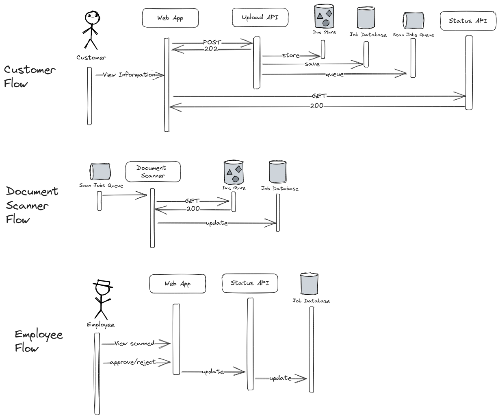

# Document Upload System
This project implements the [Async Request-Reply](https://learn.microsoft.com/en-us/azure/architecture/patterns/async-request-reply) design pattern.
It allows a user to upload documents after which the user must wait for potentially 
long-running processes to complete; document scanning, and approval/rejection by a human.

The important part is that users are not blocked once they have uploaded the document.
They can come back and check on the status at any time.

## Sequence Diagram


## Demo
What you're seeing:
- Left panel: Customer View - status of all jobs
- Middle panel: Employee View - jobs with PENDING_APPROVALS
- Right panel: Commands executed for uploads and then commands executed to approve/reject

https://github.com/p-karanthaker/doc-upload/assets/6483742/434447d1-afd9-45c9-aedf-e5ec0a67ef6c

## Modules
- [api](./api) - contains video upload and scan status api endpoints
- [scanner](./scanner) - performs long-running document scan (just a `Thread.sleep()`)
- [db](./db) - contains beans for db entities and persistence code so it can be shared with the api and scanner modules
- [s3](./s3) - contains beans for s3 client code so it can be shared with the api and scanner modules

### Other
The docker-compose file starts the api, and document scanner services, as well as a PostgreSQL database, 
Minio Object Storage, and an ActiveMQ broker.

## Endpoints
- `GET` `/status`
  - Returns all documents
- `GET` `/status/{id}`
  - Returns the status of the given document id
- `GET` `/status/pending`
  - Returns all documents pending approval
- `PATCH` `/status/{id}/approve`
  - Approves the document with the given id
- `PATCH` `/status/{id}/reject`
  - Rejects the document with the given id
- `POST` `/upload`
  - `form-data; name="file" filename="..."`
  - Content-Type: multipart/form-data

## Tests
`./gradlew test`

- [api](./api/src/test/java/me/karanthaker/api/controller) - tests for the status and upload endpoints
- [scanner](./scanner/src/test/java/me/karanthaker/scanner) - branch tests
- [db](./db) - no tests, just contains entity and repository boilerplate
- [s3](./s3) - no tests, just contains s3 client boilerplate

## Build
From the project root run:
1. `./gradlew bootJar`
2. `sudo docker compose build`

## Run
`sudo docker compose up -d`

### Upload file
```
curl -F file=@"path/to/file" localhost:8080/upload
```

### Simulate Customer view
```
watch -n 2 "curl -s localhost:8080/status | jq '.[] | \"\(.id): \(.status)\"'"
```

### Simulate Employee view
```
watch -n 2 "curl -s localhost:8080/status/pending | jq '.[] | \"\(.id): \(.status)\"'"
```

#### Employee Actions
Approve: `curl -X PATCH localhost:8080/status/{id}/approve`

Reject: `curl -X PATCH localhost:8080/status/{id}/reject`
